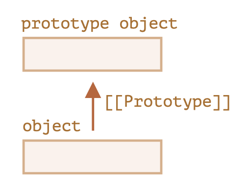

# JavaScript

---

## Objects and Object constructors

- define objects with **object literal** syntax:

```js
const myObject = {
  	property: "value",
    otherProperty: 77,
    "function property": function(){
        //do stuff
    }
};
```

- getting information
	1. dot notation: `myObject.property` //value
	2. bracket notation: `myObject["function property"]` //function

## Objects as a Design Pattern

- Group things into objects to organize 

```js
const playerOne = {
    name: "tim",
    marker: "X"
};

const playTwo = {
    name: "jenn",
    marker: "O"
};
```

- **Constructors**

```js
function Player (name, marker) {
    this.name = name;
    this.marker = marker;
    this.sayName = function() {
        console.log(name);
    }
}

//call the function with keyword new
const player = new Player('steve', 'X');
console.log(player.name) // 'steve'
player.sayName(); //'steve'
```

## Protoype

- All objects in JS have a prototype which is **another object that the original object inherits from**
	- The original object has access to all of its prototype's methods and properties
- Every JavaScript function has a **prototype property** which is empty by default
	- You can attach properties and methods on this prototype property when you want to implement inheritance
	- prototype property is not enumerable meaning that it is NOT accessible in a for/in loop

```js
function PrintStuff (doc) {
    this.doc = doc;
}

PrintStuff.prototype.print = function() {
    console.log(doc);
}
const newObj = new PrintStuff ("I am a new object and I inherited print");
newObj.print();
```


- Prototypes have **prototype attribute**s: they are like characteristics of the object
	- An object's prototype attribute points to the object's parent -- the object it inherites its properties from
	- It is formally referred to as the prototype object
	- it is set automatically when you create a new object
- Prototype attribute created with `new Object()` or **Object literal**

```javascript
const userAccount = new Object();
const userAccount = {new: "Mike"};
```

- **Prototypal inheritance**, similar to java class and superclass

- In JS, objects have a special hidden property `[[Prototype]]` which is either `null` or references another object (called **prototype**)

	

	- When we read a **missing property** from `object`, JS will automatically **takes from the prototype**. This is called **prototypal inheritance**.

- `_proto_`: to set the `[[Prototype]]` property

```javascript
let animal = {
    eats: true
    walk() {
        alert("Animal walk");
    }
};

let rabbit = {
    jumps: true,
    __proto__: animal
};

// rabbit.__proto__ = animal;
// this sets rabbit.[[Prototype]] = animal

rabbit.walk(); // animal walk
```

- Limitations:
	- references cannot go in circles -> JS will throw an error
	- the value of `__proto__` can be an object or `null`, others will be ignored
- **Prototype is only used for reading properties**
- `this` is not affected by prototypes, `this` is always the object before the dot

## Constructors and `prototype`

- best to define function on the `prototype` of that object, not inside the constructor
	- a single instance of each function will be shared between all object
	- Not duplicate function everytime a new object is created

```js
function Student (name, grade) {
    this.name = name;
    this.grade = grade;
}

Student.prototype.sayName = function() {
    console.log(this.name);
}
Student.prototype.goToProm = function() {
    console.log("go to prom");
}
```

## Best method for Prototypal Inheritance

- Set the prototype of an object: `Object.create`
	- returns a new object with the specified prototype and any additional properties you wish to add

```javascript
function Student (){};

Student.prototype.sayName = function() {
    console.log(this.name);
};

function eighthGrader(name) {
    this.name = name;
    this.grade = 8;
};

eighthGrader.prototype = Object.create(Student.prototype);

const carl = new eighthGrader("carl");
carl.sayName();
carl.grade;
```

