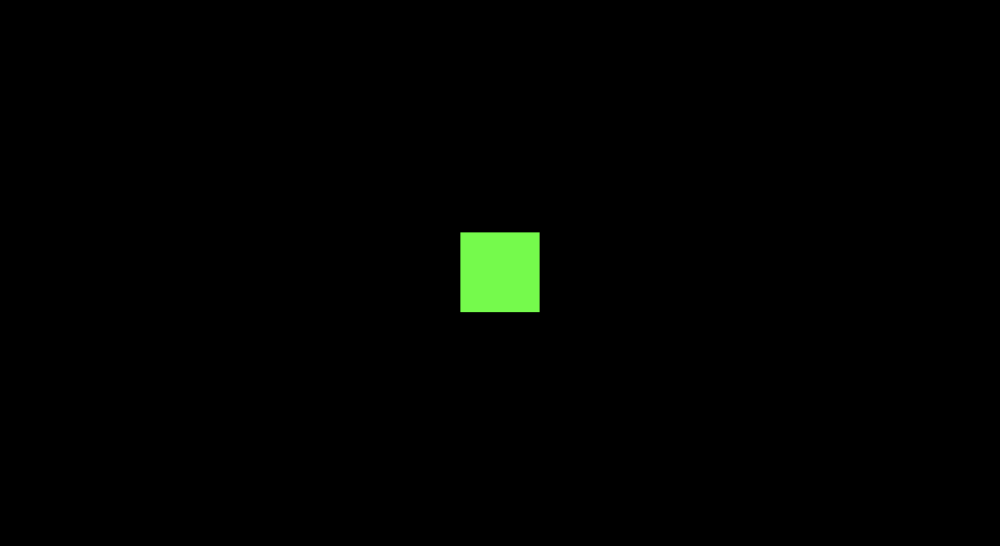

# `three.js`

---

[three.js documentation](https://threejs.org/docs/index.html#manual/en/introduction/Creating-a-scene)

---

# Creating a scene

## Preparation

```html
<!DOCTYPE html>
<html>
	<head>
		<meta charset="utf-8">
		<title>My first three.js app</title>
		<style>
			body { margin: 0; }
		</style>
	</head>
	<body>
		<script src="js/three.js"></script>
		<script>
			// Our Javascript will go here.
		</script>
	</body>
</html>
```

and put [three.js](https://threejs.org/build/three.js) in the `js` folder

## Creating the scene

- We need **three things**:
	1. scene
	2. camera
	3. renderer

```javascript
const scene = new THREE.Scene();
const camera = new THREE.PerspectiveCamera( 75, window.innerWidth / window.innerHeight, 0.1, 1000 );

const renderer = new THREE.WebGLRenderer();
renderer.setSize( window.innerWidth, window.innerHeight );
document.body.appendChild( renderer.domElement );
```

- Different **cameras** in `three.js`
	- here we are using `PerspectiveCamera`
	- first attribute is **field of view** or (FOV): <u>the extent of the scene that is seen on the display at any given moment (in degrees)</u>
	- second attribute is **aspect ratio**: almost always is the <u>width of the element divided by the height</u>
	- Next two attributes are **near** and **far** clipping plane: *objects further away from the camera than the value of **far** or closer than **near** won't be rendered*
- **renderer**: in addition to creating the renderer, we need to **set the size** at which we want our app to be rendered
	- for a performance intensive app, give `setSize` smaller values
	- render at a lower resolution, set the third argument (`updateStyle`) as false, e.g., `setSize(window.innerWidth, window.innerHeight, false)`
- Finally, we **add the `renderer` element to our HTML document**

## Creating the cube

```js
const geometry = new THREE.BoxGeometry();
const material = new THREE.MeshBasicMaterial( { color: 0x00ff00 } );
const cube = new THREE.Mesh( geometry, material );
scene.add( cube );

camera.position.z = 5;
```

- `BoxGeometry` is <u>an object that contains all the points (**vertices**) and fill (**faces**) of the cube.</u>
- `material` is used to color the cube
- `Mesh` is <u>an object that takes a geometry, and applies a material to it</u>
- `scene.add()` to add the cube to the scene, but by default its coordinates is (0,0,0)
	- Which means the camera and object are inside each other, therefore, we need to move the camera out a bit

## Rendering the scene

```javascript
function animate() {
	requestAnimationFrame( animate );
	renderer.render( scene, camera );
}
animate();
```

- we need a `render/animate loop`
	- this is a loop that **causes the renderer to draw the scene every time the screen is refreshed**



## Animating the cube

```javascript
function animate() {
	requestAnimationFrame( animate );
    cube.rotation.x += 0.01;
	cube.rotation.y += 0.01;
	renderer.render( scene, camera );
}
animate();
```

- Run every frame
- **Anything that you wish to move or change while the app is running has to go through the `animate loop`**

---

# Installation (ISSUES**)

1. `npm install --save three`

2. Import:

	````javascript
	// import the entire core lib
	import * as THREE from 'three';
	const scene = new THREE.Scene();
	````

	```javascript
	// import just the part i need
	import {Scene} from 'three';
	const scene = new Scene();
	```

---

# Drawing lines

```javascript
import * as THREE from 'three';

const scene = new THREE.Scene();

const camera = new THREE.PerspectiveCamera(45, window.innerWidth/window.innerHeight, 1, 500);
camera.position.set(0, 0, 100);
camera.lookAt(0, 0, 0);

const renderer = new THREE.WebGLRenderer();
renderer.setSize(window.innerWidth, window.innerHeight);
document.body.appendChild(renderer.domElement);
```

## define a material for lines

```javascript
const material = new THREE.LineBasicMaterial({color: 0x0000ff});
// there is also LineDashedMaterial
```

## Create a geometry with some vertices

```js
const points = [];
points.push(new THREE.Vector3(-10, 0, 0));
pointpoints.push( new THREE.Vector3( 0, 10, 0 ) );
points.push( new THREE.Vector3( 10, 0, 0 ) );

const geometry = new THREE.BufferGeometry().setFromPoints( points );
```

```js
const line = new THREE.Line( geometry, material );
```

```js
scene.add( line );
renderer.render( scene, camera );
```